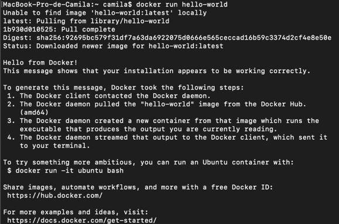
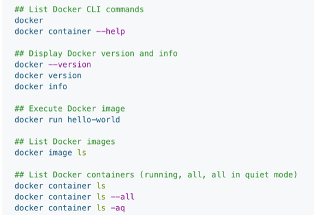

# TutorialDocker

## Conceptos de Docker
* Docker es una plataforma para desarrollar, desplegar y correr aplicaciones con contenedores.

* La contenedorización es popular ya que es:
  - Flexible: incluso las aplicaciones mas complejas pueden ser contenidas en contenedores.
  - Ligera: los contenedores aprovechan y comparten el núcleo de host.
  - Intercambiable: puede implementar actualizaciones y actualizaciones sobre la marcha.
  - Portátil: se puede compilar localmente, implementarlo en la nube y ejecutar en cualquier lugar.
  - Escalable: puede aumentar y distribuir automáticamente réplicas de contenedor.
  - Apilable: puede apilar servicios verticalmente y sobre la marcha.

* Un contenedor se lanza corriendo una **imagen** (paquete ejecutable que incluye todo lo necesario para ejecutar una aplicación).

* Un **contenedor** es una instancia de tiempo de ejecución de una imagen.


## Instalación

### 1. Instalar Docker
#### Ubuntu
```
$ curl -fsSL https://download.docker.com/linux/ubuntu/gpg | sudo apt-
key add -
$ sudo add-apt-repository "deb [arch=amd64] 
https://download.docker.com/linux/ubuntu$(lsb_release -cs) stable"
$ sudo apt-get update
$ sudo apt-get install docker-ce
```

#### CentOS
```
$ sudo yum-config-manager --add-repo https://download.docker.com/linux/centos/docker-ce.repo
$ sudo yum install docker-ce
$ sudo systemctl start docker
$ sudo systemctl enable docker
$ sudo usermod -aG docker user1
$ sudo curl -L https://github.com/docker/compose/releases/download/1.24.0-rc1/docker-compose-`uname -s`-`uname -m` -o /usr/local/bin/docker-compose
$ sudo chmod +x /usr/local/bin/docker-compose
```

#### Windows 
Tener en cuenta que Docker solo está disponible para Windows 10 64bit: Pro, Enterprise or Education.
[Docker Desktop para Windows](https://docs.docker.com/docker-for-windows/install/)

#### MacOS
[Docker Desktop para Mac](https://docs.docker.com/docker-for-mac/install/)

### 2. Verificar la versión de Docker
```
$ docker –version 
```
### 3. Conocer más a fondo información sobre Docker.
Contenedores pausados, contenedores corriendo actualmente, etc.
```
$ docker info
```
### 4. Probar que docker fue instalado correctamente.
```
$ docker run hello-world
```
Este comando debería arrojar el siguiente resultado.


### 5. Listar las imágenes descargadas en el computador.
```
$ docker image ls
```

### 6. Listar los contenedores existentes corriendo actualmente.
```
$ docker container ls
```
Listar todos los contenedores existentes, incluso los que no están corriendo. 
```
$ docker container ls –all
```

### Cheat Sheet


## Contenedores
* En el pasado, si comenzaba a escribir una aplicación de Python, su primera tarea era instalar un tiempo de ejecución de Python en su máquina. Con Docker, solo puede tomar un tiempo de ejecución Python portátil como una imagen, sin necesidad de instalación. Estas imágenes portátiles están definidas por algo llamado Dockerfile.

* Un **Dockerfile** define lo que sucede en el ambiente dentro de su contenedor. 

#### 1. Crear una aplicación en python (app.py) con el siguiente contenido. 
```python
from flask import Flask
from redis import Redis, RedisError
import os
import socket

# Connect to Redis                                                                                                    
redis = Redis(host="redis", db=0, socket_connect_timeout=2, socket_timeout=2)
app = Flask(__name__)
@app.route("/")
def hello():
    try:
        visits = redis.incr("counter")
    except RedisError:
        visits = "<i>cannot connect to Redis, counter disabled</i>"

    html = "<h3>Hello {name}!</h3>" \
           "<b>Hostname:</b> {hostname}<br/>" \
               "<b>Visits:</b> {visits}"
    return html.format(name=os.getenv("NAME", "world"),  hostname=socket.gethostname(), visits=visits)

if __name__ == "__main__":
    app.run(host='0.0.0.0', port=3000)
```
#### 2.	Crear el archivo requirements.txt con el siguiente contenido.
```
Flask
Redis
```
#### 3.	Instalar Flask y Redis.
```
$ pip install -r requirements.txt
```
#### 4.	Correr la aplicación.
```
$ python app.py
```
Ir al browser y buscar http://0.0.0.0:3000/ .


